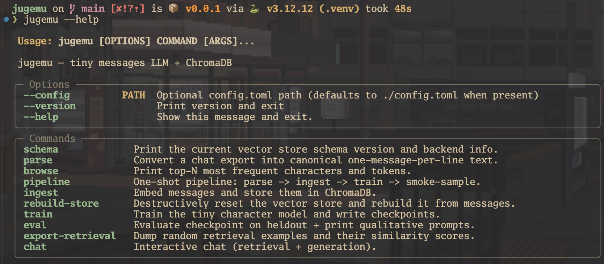
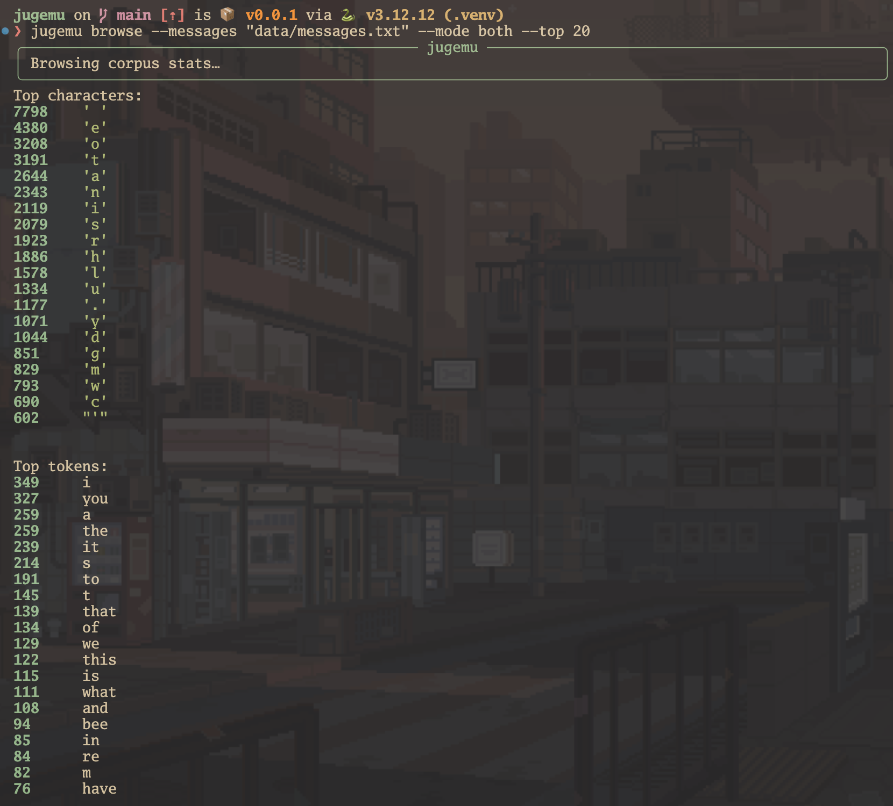
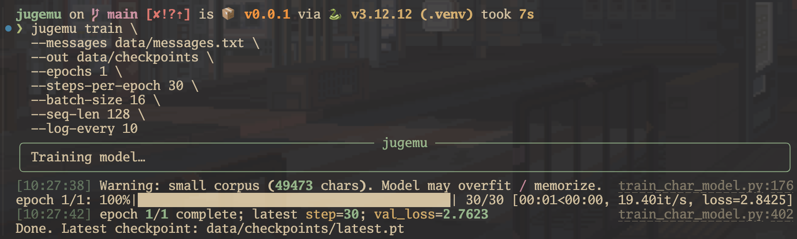
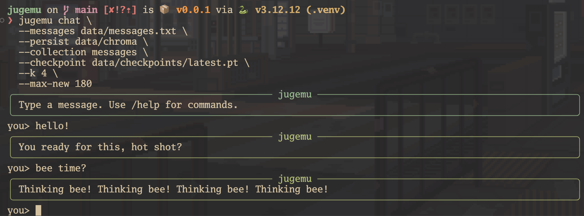
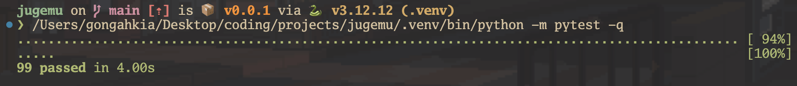
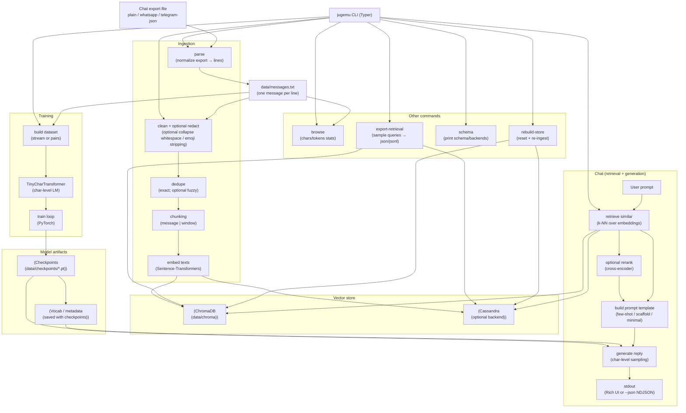

# `Jugemu`

[Tiny](https://www.merriam-webster.com/dictionary/small), [dumb](https://dictionary.cambridge.org/dictionary/english/dumb), [character-level](https://medium.com/data-science/character-level-language-model-1439f5dd87fe) language model trained locally on your message [corpus](https://dictionary.cambridge.org/dictionary/english/corpus).

## Stack

* *Backend*: [Python](https://www.python.org/), [Pydantic](https://docs.pydantic.dev/), [NumPy](https://numpy.org/), [tqdm](https://tqdm.github.io/)
* *CLI framework*: [Typer](https://typer.tiangolo.com/), [Click](https://click.palletsprojects.com/), [Rich](https://rich.readthedocs.io/)
* *Training*: [PyTorch](https://pytorch.org/), [Sentence-Transformers](https://www.sbert.net/) 
* *Vector DB*: [ChromaDB](https://www.trychroma.com/), [DataStax Python Driver for Apache Cassandra](https://docs.datastax.com/en/developer/python-driver/latest/)
* *Test*: [pytest](https://docs.pytest.org/)

## Usage

> [!Important]  
> Please read the [legal disclaimer](#legal) before using `Jugemu`.

The below instructions are for locally hosting `Jugemu`. Additionally see [here](#configuration) for flags to augment `Jugemu`'s operations.

1. First run the below commands to setup `Jugemu`'s environment.

```console
$ git clone https://github.com/gongahkia/jugemu && cd jugemu
$ python3.12 -m venv .venv && source .venv/bin/activate
$ pip install -e '.[dev]'
```

2. Add your corpus to the relative path `./data/messages.txt` from the repository's root.
3. Next run these commands to initiate the [ingestion](#architecture) and [training](#architecture) cycle.

```console
$ jugemu browse --messages data/messages.txt --mode both --top 100 # browse corpus stats
$ jugemu ingest --messages data/messages.txt --persist data/chroma --collection messages --fast-embedding-model --batch 32 # ingest the corpus to chromadb
$ jugemu train --messages data/messages.txt --out data/checkpoints --epochs 1 --steps-per-epoch 30 --batch-size 16 --seq-len 128 --log-every 10 # train a tiny checkpoint
```

4. Finally excecute the below to chat with `Jugemu`'s CLI chat context.

```console
$ jugemu chat --messages data/messages.txt --persist data/chroma --collection messages --checkpoint data/checkpoints/latest.pt --k 4 --max-new 180
```

5. Optionally run the below to export `Jugemu`'s CLI chat to a machine-readable `.json` format.

```console
$ jugemu chat --json --messages data/messages.txt --persist data/chroma --collection messages --checkpoint data/checkpoints/latest.pt
```

## Screenshots












## Architecture

> [!NOTE]  
> `Jugemu` is deliberately small and is therefore likely to not be factual or safe as it learns from short-range character patterns.



## Configuration

Most `Jugemu` commands additionally accept a global `--config` flag *(that otherwise defaults to `./config.toml` as below)*.

```toml
# ./config.toml

[paths]
messages = "data/messages.txt" # default messages path used by commands when you didn't pass --messages.
chroma_persist = "data/chroma" # chroma persist directory used by commands when you didn't pass --persist.
checkpoints = "data/checkpoints" # checkpoints directory used by train/chat/pipeline when you didn't pass --checkpoint/--out.

[chroma]
collection = "messages"

[embeddings]
model = "sentence-transformers/all-MiniLM-L6-v2"

[browse]
mode = "both" # chars|tokens|both
top = 50
min_count = 1
json = false

[export_retrieval]
samples = 10
k = 6
seed = 1337
embed_batch_size = 32
out_format = "jsonl" # json|jsonl
no_print = false

[pipeline]
vector_backend = "chroma" # chroma|cassandra
smoke_prompt = "hello"
smoke_max_new = 120

[chat]
k = 6
max_new = 240
temperature = 0.9
top_k = 60
device = "auto" # auto/cpu/mps/cuda
```

## Legal

This project is provided “as is”, without warranty of any kind.

- **Privacy / data responsibility**: You are responsible for ensuring you have the right to process any message exports you ingest (consent, local laws, workplace policies, etc.).
- **Local-first, but dependencies may download models**: jugemu does not call remote LLM APIs for inference, but embedding / reranking models are typically downloaded from third-party model hosts (commonly Hugging Face) on first use unless you pre-cache them.
- **Storage**: Ingestion stores embeddings + metadata in a local vector database directory (e.g., `data/chroma`) and training writes local checkpoints (e.g., `data/checkpoints`). Treat these as sensitive if your corpus is sensitive.
- **Safety / correctness**: Outputs can be incorrect, misleading, offensive, or reflect private content patterns from the training data. Do not rely on outputs for medical, legal, financial, or safety-critical decisions.
- **Security**: This is a local tool and not hardened as a multi-user service. Don’t expose its outputs or databases publicly without reviewing what they contain.
- **Licensing**: No `LICENSE` file is currently present in this repository; assume standard copyright applies unless you add an explicit license.

## Other notes

`Jugemu` runs the entire [ingestion, training and generation](#architecture) workflow locally and does not call any remote LLM APIs.

* [Ingestion](#architecture) writes a local ChromaDB database under `--persist` (default: `data/chroma`)
* Embeddings are [computed](#architecture) locally via `sentence-transformers` and stored in that ChromaDB directory
* [Scrub](#architecture) common PII-like strings before they ever hit the vector DB with `--redact`

## Reference

The name `Jugemu` is in reference to the [rakugo story](https://en.wikipedia.org/wiki/Rakugo) of the [same name](https://en.wikipedia.org/wiki/Jugemu), which I was first exposed to when reading the ongoing manga series [*Akane-banashi*](https://en.wikipedia.org/wiki/Akane-banashi).

<div align="center">
  
</div>
